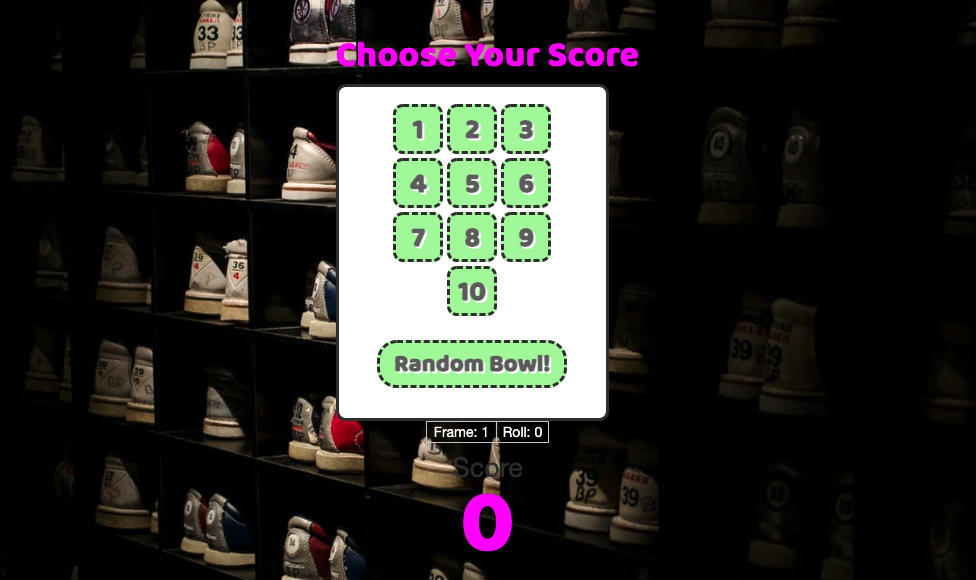

# Bowling
MiniApps fullstack practice #3. Build a single-page app implementation of a 10-pin Bowling game using Express and React.

# Requirements
> Use: Express to serve up an index.html file and its associated assets
> Build: UI using ReactJS and bundle with Webpack
> Implement: Individual gameplay logic in the client code

To satisfy the minimum requirements of this challenge, start with a user interface that allows for pin quantity selection only; i.e. the UI allows the player to select the number of pins hit on each bowl, not which pins were hit. Suggestion: create a telephone keypad-style UI that includes '10'.

Additionally, simplify gameplay by initially making this a one-person game. This allows you to focus on building and modeling the scorecard UI and scoring algorithm for a single player. As bowls happen, keep track of the score for each bowl, frame and the total score. Use React components to display the game progression and total score in the UI.

# Set Up
> Run the following commands from the root of this repository
```
npm i
```
```
npm run build
```
```
npm start
```

# Final Product

